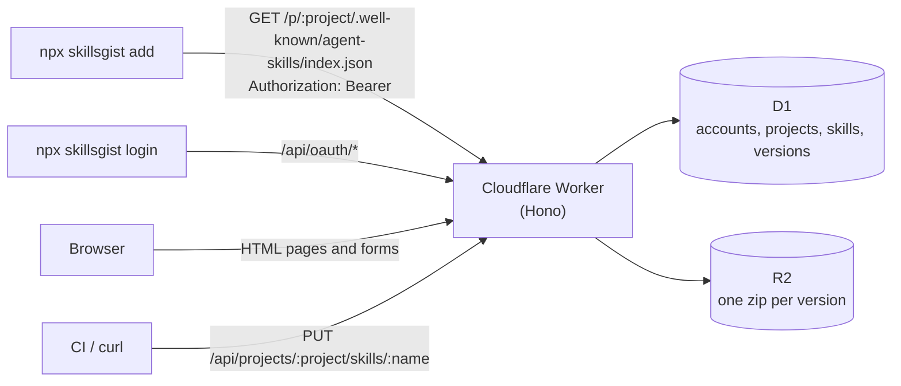

# Contributing

Issues and pull requests are welcome. [PRODUCT.md](PRODUCT.md) and [DESIGN.md](DESIGN.md) record the product decisions and the design system.

## How it works



The Worker renders every page on the server and serves the discovery index the CLI reads. D1 holds accounts, projects and their members, skills, versions and the search text. R2 holds one zip per version, addressed by the digest the index hands to the CLI.

```
src/
  index.ts        app entry and middleware
  routes/         registry, publishing, skill pages, accounts
  views/          server-rendered pages (hono/jsx)
  skills/         archive reading and normalization
  db/queries.ts   D1 access
  render/         SKILL.md to HTML
migrations/       D1 schema
public/           static assets and fonts
scripts/          verify-cli, reset-password and test fixture tools
test/             unit and integration tests
```

## Development

```bash
npm install
echo "SESSION_SECRET=$(openssl rand -hex 32)" > .dev.vars
npm run db:migrate:local
npm run dev
```

Open `http://localhost:8787/setup` to create a local admin.

```bash
npm test
npm run typecheck
npm run verify:cli
```

`npm run verify:cli` uses the published CLI; set `SKILLSGIST_CLI="node ../skillsgist-cli/dist/cli.js"` to test a local build, and quote a path that has spaces, as in `SKILLSGIST_CLI='node "../my cli/dist/cli.js"'`.

## Pull requests

Before opening a pull request, run `npm run typecheck` and `npm test`, and run `npm run verify:cli` as well if you touched the registry or publishing code.
