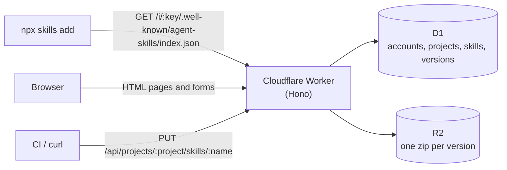

# skillsgist

A private Agent Skills registry you self-host on Cloudflare. Manage skills in the browser, install them with the stock `npx skills add`.

[](https://github.com/Qsnh/skillsgist/actions/workflows/ci.yml)
[](LICENSE)

[](https://deploy.workers.cloudflare.com/?url=https://github.com/Qsnh/skillsgist)


skillsgist gives a team one place to keep its [Agent Skills](https://skills.sh). You upload a skill in the browser; everyone on the team installs it with the same `npx skills add` they already use. There is no custom CLI, plugin or fork, and nothing is published to a shared public registry. The Worker, the database, the storage bucket and the credentials all live in your own Cloudflare account.

## Why skillsgist

- **Private by default.** A new skill is visible only to the members of its project. Making one public is a deliberate switch on that one skill.
- **The stock CLI is the client.** skillsgist serves the skills.sh discovery protocol (`/.well-known/agent-skills/index.json`) directly. `npm run verify:cli` checks this end to end against the real `npx skills` binary.
- **Your infrastructure, nearly free.** One Worker, one D1 database and one R2 bucket. The default limits fit the Workers Free plan.
- **Managed from the browser.** Publishing, editing, versions, visibility and accounts are all web pages. There is no config file to maintain.

## Features

- Publish a `.zip`, a `.tar.gz` or a single `SKILL.md`, from the browser or from a script
- Edit `SKILL.md` in the browser while the skill's other files carry over unchanged
- Immutable, numbered versions; every version stays viewable and downloadable, and republishing an older version's content rolls back
- Content-addressed artifacts, so the CLI can verify every download against its digest
- Rendered `SKILL.md` pages with a file list and version history
- Search across skill names, descriptions and body text
- Projects that group skills and people, with one install key per person per project that installs only that project's skills, and API tokens for publishing from CI
- Admin and member roles for the instance and for each project, with account and project administration in the browser
- Server-rendered pages that work without JavaScript, under a strict Content-Security-Policy


## Deploy

### One click

[](https://deploy.workers.cloudflare.com/?url=https://github.com/Qsnh/skillsgist)

The button walks you through the whole deploy:

1. Cloudflare copies this repository into your GitHub or GitLab account.
2. It creates the D1 database and the R2 bucket.
3. It asks for `SESSION_SECRET`. Paste a long random value, such as the output of `openssl rand -hex 32`.
4. It builds the project, applies the database migrations and deploys the Worker.

When it finishes, open `/setup` on the new Worker's URL to create the first admin. The copy is connected to Workers Builds, so every push to it deploys again.

### With Wrangler

You need Node.js 22 or later and a Cloudflare account.

```bash
git clone https://github.com/Qsnh/skillsgist.git
cd skillsgist
npm install
npx wrangler login

npx wrangler d1 create skillsgist        # put the printed database_id into wrangler.jsonc
npx wrangler r2 bucket create skillsgist
openssl rand -hex 32 | npx wrangler secret put SESSION_SECRET

npm run deploy                           # applies migrations, builds the CSS, deploys
```

Then open `https://<your-worker>/setup` to create the first admin. The page switches itself off as soon as any user exists.

To serve the instance on your own domain, add a route to `wrangler.jsonc` and deploy again. No code changes are needed:

```jsonc
"routes": [{ "pattern": "skills.example.com", "custom_domain": true }]
```

## Install skills

Every skill belongs to a project, and every member of a project has an install key for it. The home page, the project's page at `/p/<project>` and `/me` show your install commands, one per project. The examples below use `skills.example.com` as the instance's address.

```bash
# Every skill in the key's project, public and private
npx skills add https://skills.example.com/i/<install_key>

# One skill from that project
npx skills add https://skills.example.com/i/<install_key>/.well-known/agent-skills/<skill-name>

# One project's public skills need no key
npx skills add https://skills.example.com/p/<project>
npx skills add https://skills.example.com/p/<project>/.well-known/agent-skills/<skill-name>

# Every public skill whose name no other project also has in public
npx skills add https://skills.example.com

# Or let the CLI pick one skill out of the whole index
npx skills add https://skills.example.com -s <skill-name>
```

An install key can only install, and only its own project's skills. Whoever holds it cannot sign in, publish, delete or reach another project, and you can reset it from `/me` in one click.

Skill names are unique within a project, so two projects can each have a skill with the same name. The instance-wide address `https://skills.example.com` leaves out any name that more than one project has made public; install those from their project's address.

## Publish skills

A skill is a directory with a `SKILL.md` at its root. The `name` in its frontmatter becomes the skill's address; it must be 1–64 lowercase letters, digits and single hyphens. The `description` must be non-empty and at most 1024 characters.

```markdown
---
name: release-notes
description: Draft release notes from merged pull requests, in the team's house style.
---

# Release notes
...
```

### From the browser

- `/new` takes a `.zip`, a `.tar.gz` or a bare `SKILL.md`. A single wrapper directory is stripped, and junk files such as `.DS_Store` are dropped. It asks which project the skill goes into, out of the projects you can publish to.
- `/p/<project>/s/<name>/edit` changes only the `SKILL.md` text and carries every other file over from the previous version.
- `/p/<project>/s/<name>/upload` replaces the whole archive.

These pages refuse content that is identical to the latest version. Content identical to an *older* version publishes normally, which is how you roll back.

### From a terminal or CI

Generate an API token on `/me`. It is shown once, and it travels only in the `Authorization` header, never in a URL.

```bash
cd my-skill
zip -r - . | curl --fail-with-body -sS -X PUT --data-binary @- \
  -H "Authorization: Bearer $SKILLSGIST_TOKEN" \
  -H "Content-Type: application/zip" \
  https://skills.example.com/api/projects/<project>/skills/my-skill
```

- The name in the URL must match the `name` in `SKILL.md`, and you must be a member of the project (an instance admin can publish into any project).
- `PUT /api/skills/<name>`, the address from before projects, still works and publishes into the `default` project.
- The body can be a zip, a gzipped tarball or a bare `SKILL.md`; the format is read from the bytes. Always send a `Content-Type` such as `application/zip`, `application/gzip` or `text/markdown`. Without one, curl labels the body as a form submission, and the server refuses it with `403`.
- Add `?visibility=public` or `?visibility=private` to set visibility in the same call. Without it, a new skill starts private and an existing skill keeps its current visibility.
- The API is idempotent. A new version answers `201`; content identical to the latest version answers `200` with `"unchanged": true` and still applies `visibility`. Errors answer JSON of the form `{ "error": "...", "message": "..." }`.

Because an unchanged upload is a no-op, CI can republish on every push. For example, with GitHub Actions:

```yaml
name: Publish skill

on:
  push:
    branches: [main]
    paths: ["skills/release-notes/**"]

jobs:
  publish:
    runs-on: ubuntu-latest
    steps:
      - uses: actions/checkout@v4
      - name: Publish to skillsgist
        working-directory: skills/release-notes
        env:
          SKILLSGIST_TOKEN: ${{ secrets.SKILLSGIST_TOKEN }}
        run: |
          zip -r - . | curl --fail-with-body -sS -X PUT --data-binary @- \
            -H "Authorization: Bearer $SKILLSGIST_TOKEN" \
            -H "Content-Type: application/zip" \
            https://skills.example.com/api/projects/<project>/skills/release-notes
```

## Projects, accounts and roles

Every skill belongs to exactly one project, and people are members of projects. A project has a name, which its admins can change at any time, and an address such as `platform`, which is fixed when the project is created and appears in its page, install and API addresses. An instance has two roles:

- **Members** see and install public skills and the skills of the projects they are in, publish into those projects, and manage the skills they own there.
- **Admins** can also see and manage every project and every skill, create and delete projects, and manage every account.

Each membership has its own role:

- **Project members** see, install and publish the project's skills, and manage the ones they own.
- **Project admins** can also manage every skill in the project, rename the project, and add, remove, promote and demote its members.

`/projects` lists your projects, and instance admins create new ones at `/projects/new`. A project's page, `/p/<project>`, shows your install command for it, its skills and its members, and its admins manage the project there. Anyone can open the page of a project that has public skills, and sees only those. Move a skill to another project with Move on its page. A project can be deleted once it has no skills.

`/admin/users` lists accounts. From there an admin can switch roles, reset passwords, rotate install keys, revoke API tokens and delete accounts; `/admin/users/new` creates them. A new account is in no project until someone adds it to one. The last remaining admin can never be demoted or deleted.

**Deleting an account reassigns its skills and the author records on its versions to the admin who deletes it**, because neither may point at a user that no longer exists. The original authorship is lost.

To withdraw someone's access and keep their authorship, reset their password, remove them from their projects and revoke their API token. Their keys and token stop working at once. A browser that is already signed in, however, keeps its session until it expires, up to 30 days after sign-in. To end every session immediately, delete the account instead, or rotate `SESSION_SECRET`, which signs out everyone.

## Security model

- **The install key sits in the URL.** `npx skills` sends no custom headers, so the credential for a private install can only live in the path. That is why the key can do nothing but install, why each key reaches only one project's skills, and why it resets in one click.
- **API tokens live only in a header.** `/api/*` reads `Authorization: Bearer` and never the session cookie, so a browser cannot be tricked into publishing on someone's behalf. Tokens are stored as hashes.
- **Web forms carry a CSRF token** bound to the session, on top of an `Origin` check.
- **Sessions are signed cookies**, HMAC-signed with `SESSION_SECRET` and valid for 30 days. Passwords are hashed with PBKDF2.
- **Every page is served with a Content-Security-Policy** that allows only same-origin scripts and forbids framing.

To report a vulnerability, see [SECURITY.md](SECURITY.md).

## Limits

An upload may be at most 2 MB, unpack to at most 8 MB, and contain at most 200 files. These limits keep each request inside the Workers Free plan's 10 ms CPU budget. On Workers Paid you can raise `MAX_UPLOAD_BYTES`, `MAX_UNPACKED_BYTES` and `MAX_FILES` in `src/skills/normalize.ts`, and `PBKDF2_ITERATIONS` in `src/auth.ts`.

## Upgrade

With Wrangler, pull and deploy. `npm run deploy` applies any new migrations first:

```bash
git pull
npm install
npm run deploy
```

If you deployed with the button, your copy is a separate repository rather than a fork. Merge this repository into it and push; Workers Builds deploys again and applies any new migrations. Keep the `database_id` that Cloudflare wrote into your `wrangler.jsonc` if the merge touches it.

```bash
git remote add upstream https://github.com/Qsnh/skillsgist.git
git fetch upstream
git merge upstream/main    # the first time, Git may ask for --allow-unrelated-histories
git push
```

**Upgrading to projects.** Migration `0003_projects` puts every existing skill into a project named Default, at the address `default`, and makes every existing account a member of it, each keeping the install key it had (instance admins keep managing everything through their instance role). Install commands already in use keep working and install the same skills, `PUT /api/skills/<name>` keeps publishing into it, and old `/s/<name>` links redirect to `/p/default/s/<name>`. Accounts created after the upgrade are in no project until someone adds them.

Back up before you upgrade: run `npx wrangler d1 export DB --remote --output=backup.sql`, or rely on D1 Time Travel to restore a point before the migration. Once `0003` has run, rolling back only the Worker to an older version breaks the site, because the old code reads `users.install_key`, which the migration removes; roll back the database along with the Worker. `npm run deploy` applies migrations before it deploys the new Worker, so for a short window keyed installs and publishes may fail; upgrade at a quiet time.

## How it works



The Worker renders every page on the server and serves the discovery index the CLI reads. D1 holds accounts, projects and their members, skills, versions and the search text. R2 holds one zip per version, addressed by the digest the index hands to the CLI.

```
src/
  index.ts        app entry and middleware
  routes/         registry, publishing, skill pages, accounts
  views/          server-rendered pages (hono/jsx)
  skills/         archive reading and normalization
  db/queries.ts   D1 access
  render/         SKILL.md to HTML
migrations/       D1 schema
public/           static assets and fonts
scripts/          verify-cli and test fixture tools
test/             unit and integration tests
```

## Development

`wrangler dev` reads secrets from `.dev.vars`, which `.gitignore` excludes. Create one with a local-only session secret, then run:

```bash
npm install
echo "SESSION_SECRET=$(openssl rand -hex 32)" > .dev.vars
npm run db:migrate:local
npm run dev                # Tailwind in watch mode plus wrangler dev
```

Open `http://localhost:8787/setup` to create a local admin.

```bash
npm test                   # unit and integration tests
npm run typecheck
npm run verify:cli         # a contract test against the real npx skills
```

`verify:cli` starts its own `wrangler dev` with a throwaway session secret, so it needs no `.dev.vars`.

## Contributing

Issues and pull requests are welcome. Before opening a pull request, run `npm run typecheck` and `npm test`, and run `npm run verify:cli` as well if you touched the registry or publishing code. Code, docs and UI text are in English. [PRODUCT.md](PRODUCT.md) and [DESIGN.md](DESIGN.md) record the product decisions and the design system.

## License

[MIT](LICENSE)
