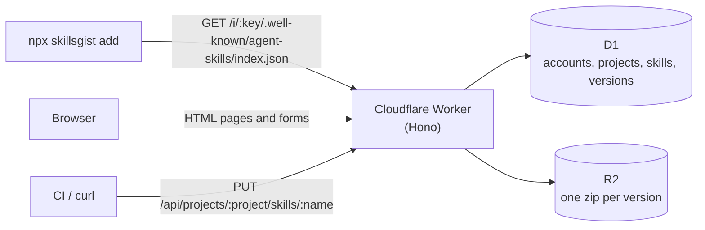

# skillsgist

A private Agent Skills registry you self-host on Cloudflare.

[](https://github.com/Qsnh/skillsgist/actions/workflows/ci.yml)
[](LICENSE)

[](https://deploy.workers.cloudflare.com/?url=https://github.com/Qsnh/skillsgist)


## Why skillsgist

- **Private by default.** A new skill is visible only to its project's members; making it public is a deliberate per-skill switch.
- **Access controlled per project.** Each project has its own members and admins, who manage it without instance-wide rights, and each person's install key opens only one project.
- **Your infrastructure, nearly free.** One Worker, D1 database and R2 bucket, within the Workers Free plan by default.
- **Managed from the browser.** Publishing, editing, versions, visibility, projects, roles and accounts are web pages, not config files.

## Features

- Publish a `.zip`, `.tar.gz` or bare `SKILL.md` from the browser or a script
- Edit `SKILL.md` in the browser, keeping the skill's other files
- Immutable numbered versions, all viewable and downloadable; republishing old content rolls back
- Content-addressed artifacts the CLI verifies by digest
- Rendered `SKILL.md` pages with files and version history
- A copyable agent prompt by each install command that has an agent install the skill with `npx skillsgist add` and follow it at once
- Search over skill names, descriptions and body text
- UI in English, Simplified Chinese, Traditional Chinese and Japanese, chosen by browser language or the footer, at the same addresses
- API tokens for publishing from CI
- Server-rendered pages that work without JavaScript, under a strict CSP


## Deploy

Requires Node.js 22+ and a Cloudflare account.

```bash
git clone https://github.com/Qsnh/skillsgist.git
cd skillsgist
npm install
npx wrangler login

npx wrangler d1 create skillsgist --no-update-config
npx wrangler r2 bucket create skillsgist --no-update-config
openssl rand -hex 32 | npx wrangler secret put SESSION_SECRET

npm run deploy  # applies migrations, builds the CSS, deploys
```

Then open `https://<your-worker>/setup` to create the first admin; the page closes once any user exists. For a custom domain, use the Worker's Settings → Domains & Routes in the Cloudflare dashboard.

## Publish from a terminal or CI

Create an API token on `/me`, or have an admin create one on your account's settings page (handy for CI-only accounts). It is shown once and only sent in the `Authorization` header.

```bash
cd my-skill
zip -r - . | curl --fail-with-body -sS -X PUT --data-binary @- \
  -H "Authorization: Bearer $SKILLSGIST_TOKEN" \
  -H "Content-Type: application/zip" \
  https://skills.example.com/api/projects/<project>/skills/my-skill
```

- The URL's name must match `name` in `SKILL.md`, and you must be a project member allowed to publish, or an instance admin.
- Send a zip, gzipped tarball or bare `SKILL.md` (detected from the bytes) with a `Content-Type` such as `application/zip`, `application/gzip` or `text/markdown`. Without one, curl sends it as a form and the server answers `403`.
- `?visibility=public` or `?visibility=private` sets visibility in the same call; otherwise a new skill starts private and an existing one keeps its visibility.
- Publishing is idempotent: a new version answers `201`; unchanged content answers `200` with `"unchanged": true` and still applies `visibility`. Errors are `{ "error": "...", "message": "..." }`.

So CI can republish on every push, e.g. with GitHub Actions:

```yaml
name: Publish skill

on:
  push:
    branches: [main]
    paths: ["skills/release-notes/**"]

jobs:
  publish:
    runs-on: ubuntu-latest
    steps:
      - uses: actions/checkout@v4
      - name: Publish to skillsgist
        working-directory: skills/release-notes
        env:
          SKILLSGIST_TOKEN: ${{ secrets.SKILLSGIST_TOKEN }}
        run: |
          zip -r - . | curl --fail-with-body -sS -X PUT --data-binary @- \
            -H "Authorization: Bearer $SKILLSGIST_TOKEN" \
            -H "Content-Type: application/zip" \
            https://skills.example.com/api/projects/<project>/skills/release-notes
```

## Projects, accounts and roles

Every skill belongs to one project, and people are project members. A project has a name its admins can change and a fixed address such as `platform` used in its page, install and API URLs.

- **Instance members** see and install public skills and their projects' skills.
- **Instance admins** also manage every project, skill and account, and create and delete projects.
- **Project members** see and install its skills; once a project admin allows it (new members start blocked), they also publish there and manage the skills they own.
- **Project admins** can always publish, and also manage every skill in the project, rename it, add, remove, promote and demote members, and allow or block their publishing.

## Limits

Uploads are capped at 2 MB, 8 MB unpacked and 200 files to fit the Workers Free plan's 10 ms CPU budget. On Workers Paid, raise `MAX_UPLOAD_BYTES`, `MAX_UNPACKED_BYTES` and `MAX_FILES` in `src/skills/normalize.ts`, and `PBKDF2_ITERATIONS` in `src/auth.ts`.

## Upgrade

With Wrangler, pull and deploy; `npm run deploy` applies new migrations first:

```bash
git pull
npm install
npm run deploy
```

## Reset a forgotten password

An admin can set a new password on any account's settings page. If no admin can sign in, use a terminal:

```bash
npm run reset-password                   # asks for the username and the new password
npm run reset-password -- alice          # names the account up front
npm run reset-password -- alice --local  # the local development database
```

## How it works


```mermaid
flowchart LR
  cli["npx skillsgist add"] -- "GET /i/:key/.well-known/agent-skills/index.json" --> worker
  browser["Browser"] -- "HTML pages and forms" --> worker
  ci["CI / curl"] -- "PUT /api/projects/:project/skills/:name" --> worker
  worker["Cloudflare Worker<br/>(Hono)"] --> d1[("D1<br/>accounts, projects, skills, versions")]
  worker --> r2[("R2<br/>one zip per version")]
```

D1 also holds memberships and search text, and each R2 zip is addressed by the digest the index gives the CLI.

```
src/
  index.ts        app entry and middleware
  routes/         registry, publishing, skill pages, accounts
  views/          server-rendered pages (hono/jsx)
  skills/         archive reading and normalization
  db/queries.ts   D1 access
  render/         SKILL.md to HTML
migrations/       D1 schema
public/           static assets and fonts
scripts/          verify-cli, reset-password and test fixture tools
test/             unit and integration tests
```

## Development

```bash
npm install
echo "SESSION_SECRET=$(openssl rand -hex 32)" > .dev.vars
npm run db:migrate:local
npm run dev
```

Open `http://localhost:8787/setup` to create a local admin.

```bash
npm test
npm run typecheck
npm run verify:cli
```

## Contributing

Issues and pull requests are welcome. Before opening one, run `npm run typecheck` and `npm test`, plus `npm run verify:cli` if you touched registry or publishing code. [PRODUCT.md](PRODUCT.md) and [DESIGN.md](DESIGN.md) record the product decisions and design system.

## License

[MIT](LICENSE)
