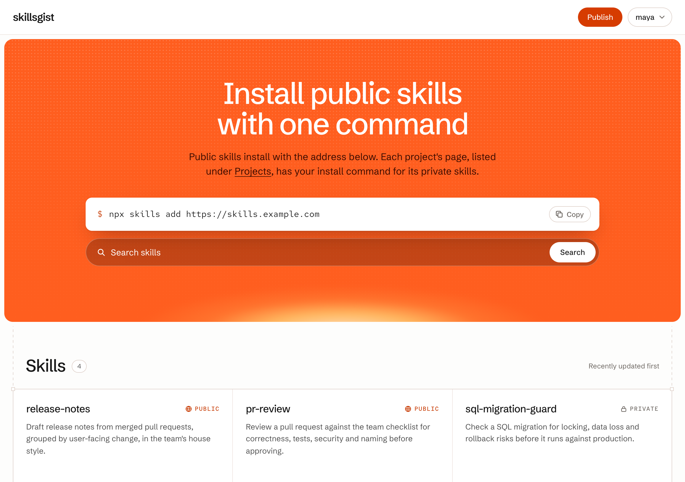
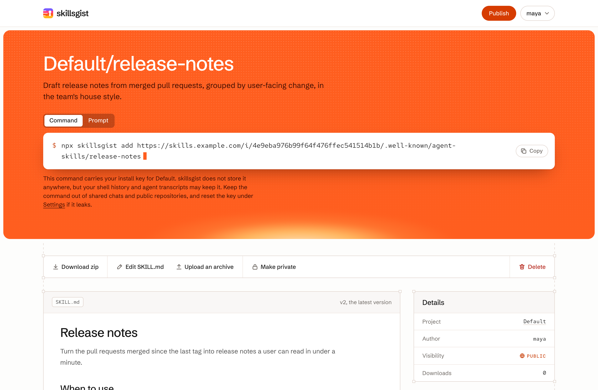
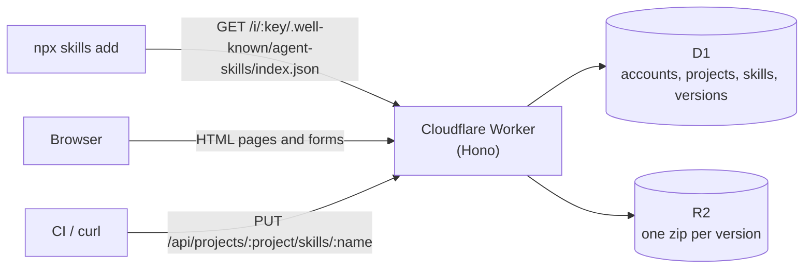

# skillsgist

A private Agent Skills registry you self-host on Cloudflare.

[](https://github.com/Qsnh/skillsgist/actions/workflows/ci.yml)
[](LICENSE)

[](https://deploy.workers.cloudflare.com/?url=https://github.com/Qsnh/skillsgist)



## Why skillsgist

- **Private by default.** A new skill is visible only to the members of its project. Making one public is a deliberate switch on that one skill.
- **Access controlled per project.** Each project has its own members and admins. Project admins manage their project's people and skills without instance-wide rights, and an install key opens only one project.
- **Your infrastructure, nearly free.** One Worker, one D1 database and one R2 bucket. The default limits fit the Workers Free plan.
- **Managed from the browser.** Publishing, editing, versions, visibility, projects and accounts are all web pages. There is no config file to maintain.

## Features

- Publish a `.zip`, a `.tar.gz` or a single `SKILL.md`, from the browser or from a script
- Edit `SKILL.md` in the browser while the skill's other files carry over unchanged
- Immutable, numbered versions; every version stays viewable and downloadable, and republishing an older version's content rolls back
- Content-addressed artifacts, so the CLI can verify every download against its digest
- Rendered `SKILL.md` pages with a file list and version history
- Search across skill names, descriptions and body text
- The web UI in English, Simplified Chinese, Traditional Chinese and Japanese, picked from the browser's language or the footer, at the same addresses in every language
- Projects that group skills and people, with one install key per person per project that installs only that project's skills
- API tokens for publishing from CI
- Admin and member roles for the instance and for each project, with account and project administration in the browser
- Server-rendered pages that work without JavaScript, under a strict Content-Security-Policy



## Deploy

### One click

[](https://deploy.workers.cloudflare.com/?url=https://github.com/Qsnh/skillsgist)

The button walks you through the whole deploy:

1. Cloudflare copies this repository into your GitHub or GitLab account.
2. It creates the D1 database and the R2 bucket.
3. It asks for `SESSION_SECRET`. Paste a long random value, such as the output of `openssl rand -hex 32`.
4. It builds the project, applies the database migrations and deploys the Worker.

When it finishes, open `/setup` on the new Worker's URL to create the first admin. The copy is connected to Workers Builds, so every push to it deploys again.

### With Wrangler

You need Node.js 22 or later and a Cloudflare account.

```bash
git clone https://github.com/Qsnh/skillsgist.git
cd skillsgist
npm install
npx wrangler login

npx wrangler d1 create skillsgist --no-update-config
npx wrangler r2 bucket create skillsgist --no-update-config
openssl rand -hex 32 | npx wrangler secret put SESSION_SECRET

npm run deploy                           # applies migrations, builds the CSS, deploys
```

Then open `https://<your-worker>/setup` to create the first admin. The page switches itself off as soon as any user exists.

To serve the instance on your own domain, open the Worker in the Cloudflare dashboard and add a Custom Domain under Settings → Domains & Routes.

## Publish from a terminal or CI

Generate an API token on `/me`, or have an admin generate one on your account's settings page, which suits an account used only by CI. It is shown once, and it travels only in the `Authorization` header, never in a URL.

```bash
cd my-skill
zip -r - . | curl --fail-with-body -sS -X PUT --data-binary @- \
  -H "Authorization: Bearer $SKILLSGIST_TOKEN" \
  -H "Content-Type: application/zip" \
  https://skills.example.com/api/projects/<project>/skills/my-skill
```

- The name in the URL must match the `name` in `SKILL.md`, and you must be a member of the project who is allowed to publish (an instance admin can publish into any project).
- The body can be a zip, a gzipped tarball or a bare `SKILL.md`; the format is read from the bytes. Always send a `Content-Type` such as `application/zip`, `application/gzip` or `text/markdown`. Without one, curl labels the body as a form submission, and the server refuses it with `403`.
- Add `?visibility=public` or `?visibility=private` to set visibility in the same call. Without it, a new skill starts private and an existing skill keeps its current visibility.
- The API is idempotent. A new version answers `201`; content identical to the latest version answers `200` with `"unchanged": true` and still applies `visibility`. Errors answer JSON of the form `{ "error": "...", "message": "..." }`.

Because an unchanged upload is a no-op, CI can republish on every push. For example, with GitHub Actions:

```yaml
name: Publish skill

on:
  push:
    branches: [main]
    paths: ["skills/release-notes/**"]

jobs:
  publish:
    runs-on: ubuntu-latest
    steps:
      - uses: actions/checkout@v4
      - name: Publish to skillsgist
        working-directory: skills/release-notes
        env:
          SKILLSGIST_TOKEN: ${{ secrets.SKILLSGIST_TOKEN }}
        run: |
          zip -r - . | curl --fail-with-body -sS -X PUT --data-binary @- \
            -H "Authorization: Bearer $SKILLSGIST_TOKEN" \
            -H "Content-Type: application/zip" \
            https://skills.example.com/api/projects/<project>/skills/release-notes
```

## Projects, accounts and roles

Every skill belongs to exactly one project, and people are members of projects. A project has a name, which its admins can change at any time, and an address such as `platform`, which is fixed when the project is created and appears in its page, install and API addresses. An instance has two roles:

- **Members** see and install public skills and the skills of the projects they are in, publish into those projects where a project admin allows it, and manage the skills they own there.
- **Admins** can also see and manage every project and every skill, create and delete projects, and manage every account.

Each membership has its own role:

- **Project members** see and install the project's skills. Once a project admin allows their publishing, they also publish into the project and manage the skills they own there. New members start with publishing blocked; a blocked member still sees and installs everything in the project, but can neither publish into it nor manage the skills they own there.
- **Project admins** can also manage every skill in the project, rename the project, add, remove, promote and demote its members, and allow or block each member's publishing. Project admins can always publish.

**Deleting an account reassigns its skills and the author records on its versions to the admin who deletes it**, because neither may point at a user that no longer exists. The original authorship is lost.

## Limits

An upload may be at most 2 MB, unpack to at most 8 MB, and contain at most 200 files. These limits keep each request inside the Workers Free plan's 10 ms CPU budget. On Workers Paid you can raise `MAX_UPLOAD_BYTES`, `MAX_UNPACKED_BYTES` and `MAX_FILES` in `src/skills/normalize.ts`, and `PBKDF2_ITERATIONS` in `src/auth.ts`.

## Upgrade

With Wrangler, pull and deploy. `npm run deploy` applies any new migrations first:

```bash
git pull
npm install
npm run deploy
```

If you deployed with the button, your copy is a separate repository rather than a fork. Merge this repository into it and push; Workers Builds deploys again and applies any new migrations.

```bash
git remote add upstream https://github.com/Qsnh/skillsgist.git
git fetch upstream
git merge upstream/main
git push
```

## Reset a forgotten password

An admin can set a new password for any account on that account's settings page. If no admin can sign in, reset the password from a terminal instead:

```bash
npm run reset-password                   # asks for the username and the new password
npm run reset-password -- alice          # names the account up front
npm run reset-password -- alice --local  # the local development database
```

The script writes the new password straight to the D1 database, so it needs the same Wrangler login as `npm run deploy`. If you deployed with the button, clone your copy and run `npm install` and `npx wrangler login` first. Sessions that are already signed in stay signed in; to sign everyone out, change `SESSION_SECRET`.

## How it works


```mermaid
flowchart LR
  cli["npx skills add"] -- "GET /i/:key/.well-known/agent-skills/index.json" --> worker
  browser["Browser"] -- "HTML pages and forms" --> worker
  ci["CI / curl"] -- "PUT /api/projects/:project/skills/:name" --> worker
  worker["Cloudflare Worker<br/>(Hono)"] --> d1[("D1<br/>accounts, projects, skills, versions")]
  worker --> r2[("R2<br/>one zip per version")]
```

The Worker renders every page on the server and serves the discovery index the CLI reads. D1 holds accounts, projects and their members, skills, versions and the search text. R2 holds one zip per version, addressed by the digest the index hands to the CLI.

```
src/
  index.ts        app entry and middleware
  routes/         registry, publishing, skill pages, accounts
  views/          server-rendered pages (hono/jsx)
  skills/         archive reading and normalization
  db/queries.ts   D1 access
  render/         SKILL.md to HTML
migrations/       D1 schema
public/           static assets and fonts
scripts/          verify-cli, reset-password and test fixture tools
test/             unit and integration tests
```

## Development

```bash
npm install
echo "SESSION_SECRET=$(openssl rand -hex 32)" > .dev.vars
npm run db:migrate:local
npm run dev
```

Open `http://localhost:8787/setup` to create a local admin.

```bash
npm test
npm run typecheck
npm run verify:cli
```

## Contributing

Issues and pull requests are welcome. Before opening a pull request, run `npm run typecheck` and `npm test`, and run `npm run verify:cli` as well if you touched the registry or publishing code. [PRODUCT.md](PRODUCT.md) and [DESIGN.md](DESIGN.md) record the product decisions and the design system.

## License

[MIT](LICENSE)
